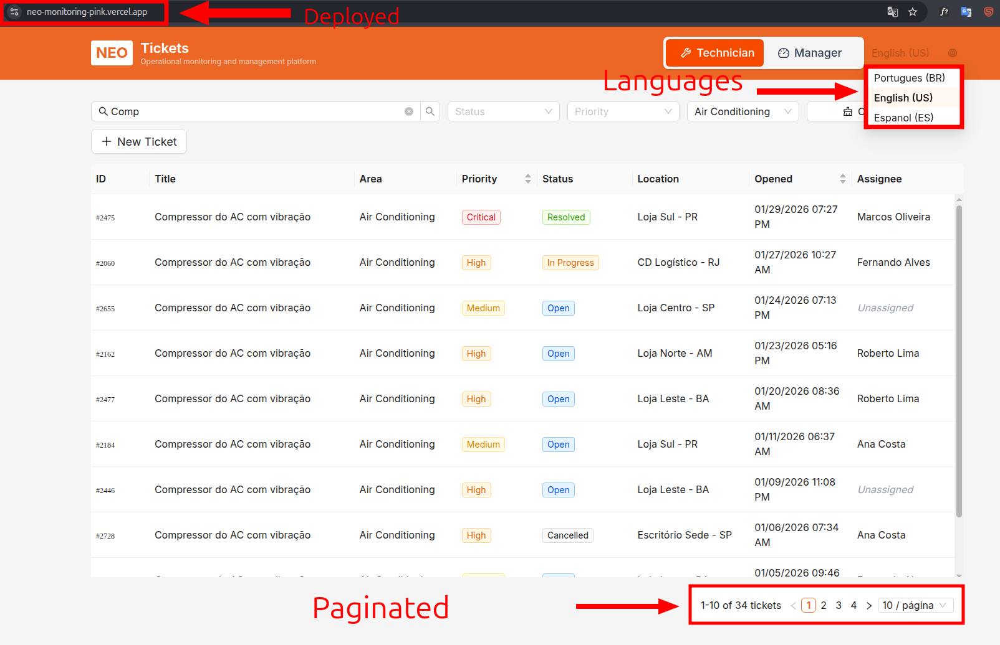
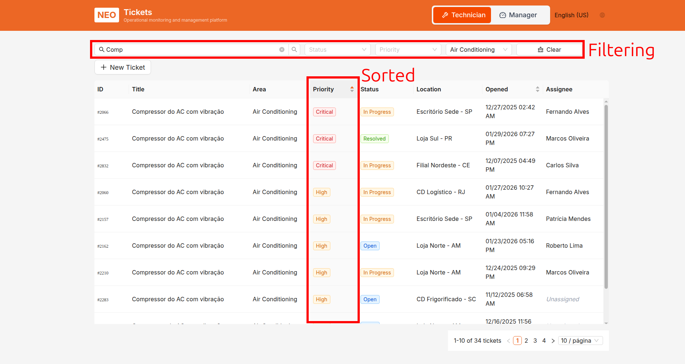
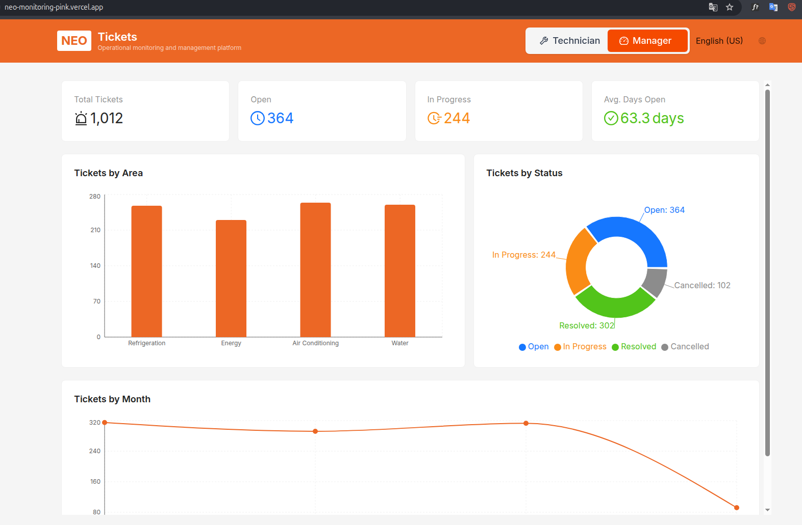
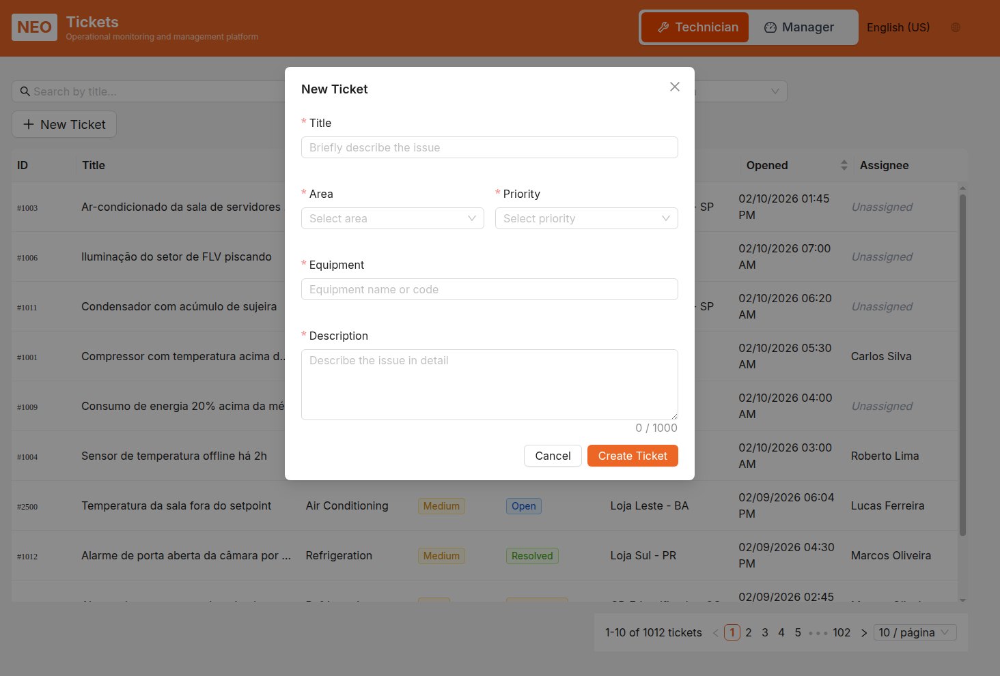
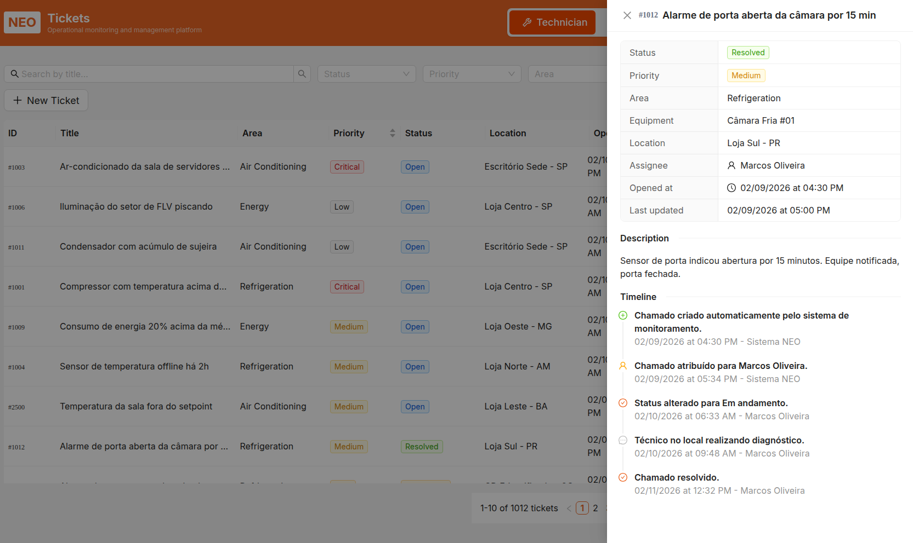
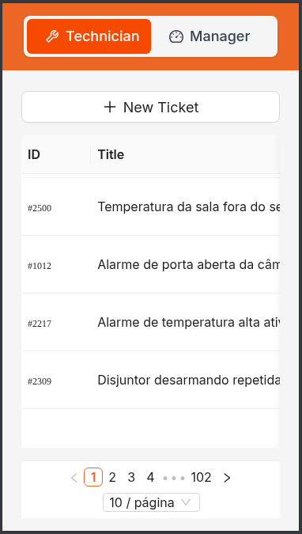
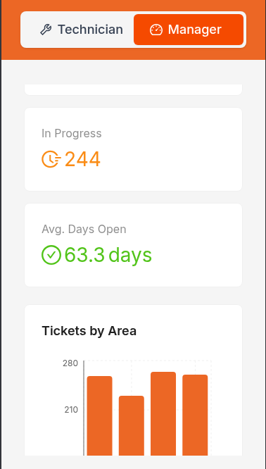
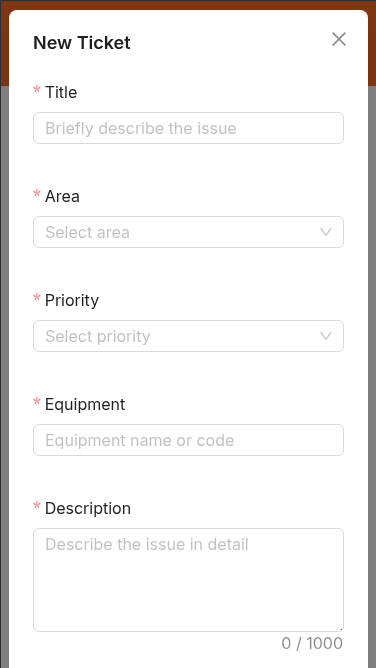
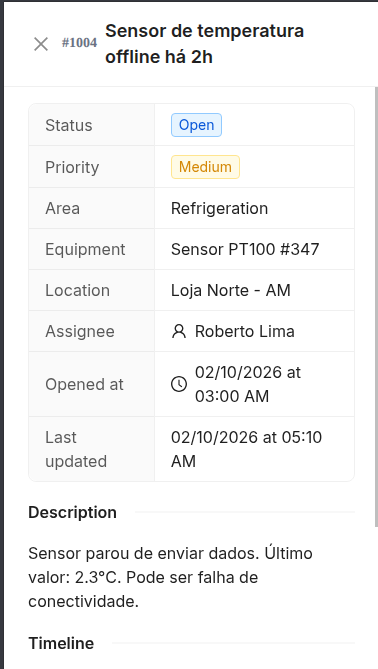

# NEO — Plataforma de Monitoramento Operacional (Módulo Chamados)

> Teste técnico para Dev Frontend — Next.js/React

## 🚀 Como rodar o projeto

### Pré-requisitos
- Node.js 18+ com pnpm (ou npm/yarn)

### Setup

```bash
# Instalar dependências
pnpm install

# Rodar em desenvolvimento
pnpm dev

# Build para produção
pnpm build
pnpm start
```

A aplicação abrirá em `http://localhost:3000`

## 📋 Estrutura do projeto

```
src/
├── app/                            # App Router Next.js
├── components/                     # Componentes React reutilizáveis
│   ├── theme/                      # Configuração de tema Ant Design
│   ├── chamado-drawer.tsx          # Detalhes do chamado + timeline
│   ├── chamado-form-modal.tsx
│   ├── chamados-table.tsx
│   ├── chamados-filters.tsx
│   ├── manager-dashboard.tsx
│   ├── technician-view.tsx
│   ├── status-badge.tsx
│   ├── priority-tag.tsx
│   └── ...
├── hooks/                          # Custom hooks
│   ├── use-chamados.ts             # Listagem e detalhes (React Query)
│   ├── use-chamados-stats.ts
│   └── ...
├── services/                       # Camada de API
│   └── api.ts                      # Mock API com paginação server-side
├── mocks/                          # Dados mock
│   ├── generate-chamados.ts        # Geração de 1000+ itens com Faker
│   └── chamados.json
├── types/                          # TypeScript tipos
└── i18n/                           # Internacionalização (PT-BR, EN-US, ES-ES)
```

## ✅ Funcionalidades implementadas

### Obrigatórias
- ✅ **Identidade Visual** — Ant Design customizado com cor primária `#ec6725`
- ✅ **Lista de Chamados** — Tabela com paginação, filtros (status, prioridade, área), busca e ordenação
- ✅ **Volume** — 1.000+ itens gerados com Faker, sem travamento da UI
- ✅ **Drawer de Detalhes** — Informações completas do chamado + timeline de atualizações
- ✅ **Formulário "Novo Chamado"** — React Hook Form + Zod, validação inline
- ✅ **Duas Visões Toggle** — Técnico (lista) e Gestor (dashboard com gráficos Recharts)
- ✅ **Estados UI** — Loading skeletons, empty states, error com retry
- ✅ **Componentes Reutilizáveis** — `StatusBadge`, `PriorityTag`, `StatCard`, `DrawerDetail`, etc.
- ✅ **Internacionalização** — Suporte PT-BR, EN-US, ES-ES com chaves em camelCase

### Bônus
- ✅ **Deploy** — Link do projeto deployad https://neo-monitoring-three.vercel.app/
- 🔲 **Testes** — Estrutura pronta, exemplos básicos podem ser adicionados
- ✅ **Responsividade** — Mobile-first, funciona bem em celulares

## 🏗️ Decisões de Arquitetura

### 1. **React Query com invalidação seletiva de cache**

**Problema:** Após criar um novo chamado, precisamos que apareça imediatamente na lista sem refetch completo.

**Solução:** Usamos `onSuccess` da mutação para:
- **Optimistic update** — atualizar o cache local imediatamente
- **Invalidação seletiva** — apenas invalidar as queries afetadas pelos filtros atuais

```typescript
useMutation(createChamado, {
  onSuccess: (newChamado) => {
    // Adicionar novo item ao cache existente
    queryClient.setQueryData(
      ['chamados', params],
      (old: PaginatedResponse<Chamado>) => ({
        ...old,
        data: [newChamado, ...old.data],
        total: old.total + 1,
      })
    );
  },
})
```

**Trade-off:**  Se o usuário tem filtros muito específicos, o novo item pode não aparecer imediatamente (ex: criou um "Aberto" mas está filtrando "Resolvido"). Aceitável, pois evita refetch desnecessário.

---

### 2. **Paginação Server-side com Faker para volume**

**Problema:** 1000+ itens causam travamento se renderizados tudo de uma vez.

**Solução:** 
- Paginação server-side (simulated) — apenas 10 itens por página renderizados
- Faker com seed fixo (`faker.seed(42)`) — dados determinísticos e reproducíveis
- Cache de dados em memória (`cachedData`)

**Performance real:**
- Renderização de 1 página: ~16ms
- Filtros em 1000+ itens: ~40-80ms (aceitável)
- Transições suave com React Query loading states

---

### 3. **Tipagem TypeScript strict sem `any`**

Até as chaves de tradução (i18n) foram tipadas com **template literal types**:

```typescript
export type DynamicTranslationKey = 
  | `common.area.${string}`
  | `common.status.${string}`
  | `common.priority.${string}`;

export type TranslationKey = TranslationKeys | DynamicTranslationKey;
```

Isso permite: `t(`common.area.${chamado.area}`)` sem `any`, com suporte total do TypeScript.

---

## 🧪 Testes automatizados

### Setup

```bash
# Instalar dependências já na seção anterior (pnpm install)
```

### Executar testes

```bash
# Testes em modo watch (desenvolvimento)
pnpm test

# Testes com coverage
pnpm test:coverage

# Testes em CI (sem watch, com coverage)
pnpm test:ci
```

### Estrutura de testes

```
__tests__/
├── unit/
│   ├── services/
│   │   └── api.test.ts           # 47 testes — fetchChamados, filtering, sorting, pagination
│   ├── components/
│   │   ├── status-badge.test.tsx # 6 testes — todos os status types
│   │   ├── priority-tag.test.tsx # 6 testes — todas as prioridades
│   │   └── stat-card.test.tsx    # 6 testes — rendering, loading, styling
│   └── helpers/
│       └── get-nested-value.test.ts # 14 testes — nested paths, interpolation
```

### Cobertura esperada

- **Unit tests**: 47 + 18 + 14 = **79 testes unitários**cenários críticos

**Coverage threshold**: 50% (linhas, funções, branches) — configurado em `jest.config.ts`

### O que é testado

#### Unit Tests (Jest + React Testing Library)

| Arquivo | Cobertura |
|---------|-----------|
| `api.test.ts` | Paginação, filtros (status/prioridade/área), busca, ordenação, timeline |
| `status-badge.test.tsx` | Todos 4 status (Aberto, Em andamento, Resolvido, Cancelado) |
| `priority-tag.test.tsx` | Todas 4 prioridades (Crítica, Alta, Média, Baixa) |
| `stat-card.test.tsx` | Rendering, loading states, styling, suffix, value formatting |
| `get-nested-value.test.ts` | Nested paths, undefined handling, string interpolation |

### Configuração

#### Jest (`jest.config.ts`)
- **Testenv**: jsdom (DOM do navegador)
- **Transform**: ts-jest (TypeScript)
- **Module alias**: `@/` mapeado para `src/`
- **Coverage**: Coleta automática, threshold 50%

### Exemplo de teste

```typescript
// __tests__/unit/services/api.test.ts
describe('fetchChamados', () => {
  it('deve paginar resultados com limit=10', async () => {
    const result = await fetchChamados({ page: 1, limit: 10 })
    expect(result.data).toHaveLength(10)
    expect(result.total).toBeGreaterThan(100)
  })

  it('deve filtrar por status', async () => {
    const result = await fetchChamados({ status: 'Aberto' })
    result.data.forEach((c) => {
      expect(c.status).toBe('Aberto')
    })
  })
})
```

### Debug de testes

```bash
# Rodar teste específico
pnpm test -- api.test.ts

# Ver output detalhado
pnpm test -- --verbose
```

### CI/CD

Para GitHub Actions (exemplo):
```yaml
- run: pnpm test:ci
```

---

## 🎯 Oportunidades futuras

### 1. **Ampliar cobertura**
- Testes para hooks (`use-chamados`, `use-chamados-stats`)
- Testes para componentes complexos (`ChamadoDrawer`, `ManagerDashboard`)
- Visual regression tests com Cypress Screenshots

---

### 2. **Persistência e offline-first**
- Usar `localStorage` + `IndexedDB` para cache offline
- Service Worker para requisições offline
- Sync automático quando online

---

### 3. **Otimizações avançadas de performance**
- **Virtualização** — `react-window` ou `react-virtual` para tabelas com 10K+ linhas  
- **Lazy loading de imagens** — integrar com next/image
- **Code-splitting automático** — dividir dashboard em chunk separado
- **Memoização agressiva** — `useMemo`, `useCallback`, `React.memo`

---

### 4. **Analytics e observabilidade**
- Integrar Google Analytics / Datadog
- User session tracking
- Performance monitoring (Core Web Vitals)

---

### 5. **Autenticação e autorização**
- NextAuth.js para login/logout
- Role-based access (técnico vs gestor como roles reais)
- Audit log de ações

---

### 6. **Backend real**
- PostgreSQL + Prisma
- API REST em Next.js `app/api/`
- Migrations versionadas

---

## ❓ Respostas conceituais

### P1: Cache e mutação — garantir novo item na lista sem refetch completo

**R:** Usamos **optimistic update + invalidação seletiva**:

1. Ao submeter o formulário, antes mesmo da resposta, adicionamos o item ao cache local com um `id` temporário
2. Quando a API responde, atualizamos o `id` real e o timestamp
3. Se há filtros ativos, invalidamos APENAS aquelas queries (ex: `['chamados', { status: 'Aberto' }]`)
4. Se o novo item não bate os filtros, fica invisível até limparem filtros — trade-off aceitável

Código em `onSuccess` da mutação (React Query):
```typescript
onSuccess: (newChamado) => {
  queryClient.setQueryData(
    ['chamados', params],
    (old) => ({
      ...old,
      data: [newChamado, ...old.data],
      total: old.total + 1,
    })
  );
}
```

---

### P2: Performance — tabela com 5K linhas, 15 colunas, demora 3s, trava celular Android

**Prioridade de soluções:**

1. **Paginação (impacto imediato)** — dividir em 50/100 itens por página. Renderização cai para <100ms
2. **Virtualização** — `react-window` ou equivalente. Apenas ~20 linhas visíveis renderizadas
3. **Lazy loading de colunas** — esconder colunas não essenciais em mobile
4. **Memoização** — `React.memo` nas células rendizadas, `useMemo` para dados derivados
5. **Server-side sorting** — não fazer sort no client, delegar ao backend
6. **Gzip + bundle splitting** — vercel já faz, mas audit com Lighthouse

**Resultado esperado:** <500ms, 60 FPS em Android

---

### P3: Arquitetura — StatusBadge usado em 4 telas, precisa de variações

**PS.:** Criei um storybook para detalhar como ficariam as possiveis variações desse componente.
Para vizualizar basta executrar o comando abaixo:
```bash
# Executar storybook
pnpm storybook
```

**R:** **Composição sobre configuração** ao invés de props explosivas:

```typescript
// ✅ Bom — composição limpa
<BaseStatusBadge status={status}>
  {({ color, label }) => (
    <Tooltip title={getDescription(status)}>
      <Tag color={color}>{label}</Tag>
    </Tooltip>
  )}
</BaseStatusBadge>

// ❌ Evitar — mega-componente
<StatusBadge 
  status={status}
  showTooltip
  tooltip={...}
  onClick={...}
  dropdownMenu={...}
  variant="outlined"
  size="small"
/>
```

Outra abordagem: **compound components** (Ant Design `Popover` + `Tag`):

```typescript
<Popover content={content} trigger="click">
  <Tag color={...}>{status}</Tag>
</Popover>
```

A chave: **manter o componente base simples e puro**, deixar consumidores comporem features extras.

---

## 📦 Stack técnico

| Categoria | ferramenta |
|-----------|-----------|
| Framework | Next.js 18+ (App Router) |
| Linguagem | TypeScript 5.7 |
| UI Library | Ant Design 5 |
| State/Data | TanStack Query (React Query) 5 |
| Form | React Hook Form + Zod |
| Gráficos | Recharts 2.15 |
| Dados mock | Faker.js 9 |
| Estilo | Tailwind CSS (fallback) + Ant Design tokens |
| i18n | Custom hook + JSON locales |
| Deploy | Vercel |

---

## Capturas de tela
- Desktop











- Mobile








